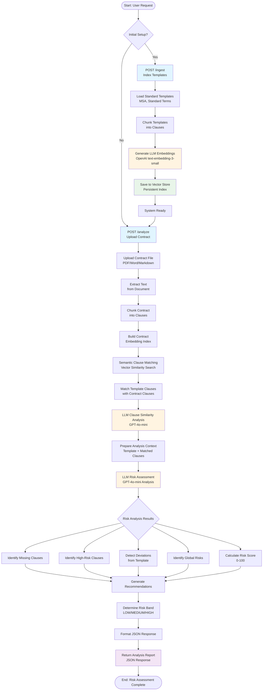

# Procurement Contract Analyzer (LLM-Powered RAG + AI Risk Assessment)

A sophisticated FastAPI service that compares an **uploaded supplier contract** against a **standard template** using LLM embeddings and AI-powered risk assessment.
- **LLM-powered RAG**: Semantic clause retrieval using OpenAI embeddings for accurate matching.
- **AI Risk Agent**: GPT-4 powered comprehensive risk analysis with contextual understanding.
- **LLM-First Architecture**: Optimized for AI-powered analysis with comprehensive risk assessment.
- **Intelligent Workflow**: *ingest → LLM embed → retrieve → AI analyze → risk assess → report*.

## Quick start

```bash
# 1) Create virtual environment (recommended)
python3 -m venv .venv
source .venv/bin/activate

# 2) Install dependencies
pip install -r requirements.txt

# 3) Set OpenAI API key (required)
# Option A: Set environment variable
export OPENAI_API_KEY='your-openai-api-key-here'

# Option B: Edit .env file (recommended)
# Copy .env.example to .env and add your API key
cp .env.example .env
# Then edit .env file with your API key

# 4) Test the setup (optional)
python test_llm_workflow.py

# 5) Run the API server
uvicorn app.main:app --reload --port 8000

# 6) Test with a contract (see examples/curl_requests.md)
curl -X POST http://localhost:8000/analyze \
  -F "template_name=master_service_agreement" \
  -F "file=@data/contracts/sample_contract_acme.md"
```

## Workflow Overview

The following diagram illustrates the end-to-end workflow of the contract analysis system:



### Workflow Stages

1. **Setup Phase** (`POST /ingest`):
   - Load standard contract templates
   - Chunk templates into individual clauses
   - Generate LLM embeddings for each clause
   - Store embeddings in vector database for fast retrieval

2. **Analysis Phase** (`POST /analyze`):
   - **Input**: Upload contract file (PDF/Word/Markdown)
   - **Extraction**: Extract text and chunk into clauses
   - **Embedding**: Generate embeddings for contract clauses
   - **Matching**: Use semantic search to match contract clauses with template clauses
   - **Similarity**: LLM analyzes clause-by-clause similarity and differences
   - **Risk Assessment**: GPT-4 comprehensively analyzes the entire contract
   - **Output**: Generate risk score, identify issues, and provide recommendations

3. **Key AI Components**:
   - **RAG (Retrieval-Augmented Generation)**: Uses embeddings for accurate clause matching
   - **LLM Analysis**: GPT-4 provides context-aware risk assessment
   - **Semantic Understanding**: Goes beyond keyword matching to understand meaning

## Endpoints
- `POST /ingest` → (re)index templates & policies using LLM embeddings
- `POST /analyze` (multipart) → upload a contract and get AI-powered risk analysis
  - Parameters:
    - `template_name`: Template to compare against (default: `master_service_agreement`)
    - `file`: Contract file to analyze

## LLM-Powered Features
- **Semantic Clause Matching**: Uses OpenAI embeddings for accurate clause pairing
- **AI Risk Assessment**: GPT-4 analyzes contracts for comprehensive risk evaluation
- **Contextual Understanding**: Identifies nuanced risks and deviations
- **Intelligent Recommendations**: Provides actionable suggestions for risk mitigation
- **Environment Configuration**: Secure API key management via .env file

## Output
Enhanced JSON report with:
- **AI Risk Analysis**: Comprehensive risk assessment with explanations
- **Semantic Similarity**: LLM-powered clause matching scores
- **Risk Recommendations**: Actionable suggestions for risk mitigation
- **Missing Clauses**: AI-identified critical missing sections
- **Deviation Analysis**: Detailed analysis of contract deviations
- **Overall Risk Score**: 0-100 with AI-generated risk band (LOW/MEDIUM/HIGH)

## Architecture
- **LLM Adapter** (`app/adapters/llm_adapter.py`): OpenAI integration for embeddings and chat
- **LLM Risk Agent** (`app/analyzers/llm_risk_agent.py`): AI-powered risk assessment
- **LLM Retriever** (`app/rag/retriever.py`): Semantic search using embeddings
- **Environment Management**: Secure .env file configuration for API keys

## Project Structure
```
procurement_contract_analyzer/
├── app/                            # Main application code
│   ├── adapters/
│   │   └── llm_adapter.py          # OpenAI integration for embeddings and chat
│   ├── analyzers/
│   │   └── llm_risk_agent.py       # AI-powered risk assessment agent
│   ├── main.py                     # FastAPI application with LLM endpoints
│   ├── models/
│   │   └── schemas.py              # Pydantic data models
│   ├── rag/                        # RAG (Retrieval-Augmented Generation) components
│   │   ├── chunker.py              # Text segmentation into clauses
│   │   ├── retriever.py             # LLM-powered semantic search
│   │   └── store.py                # Vector store persistence
│   └── utils/
│       └── io.py                    # File processing (PDF, DOCX, etc.)
├── data/                           # Data files and templates
│   ├── contracts/
│   │   └── sample_contract_acme.md  # Sample contract for testing
│   └── templates/
│       ├── master_service_agreement.md  # Standard MSA template
│       └── standard_terms.md           # Standard terms template
├── examples/                       # Usage examples
│   └── curl_requests.md             # API usage examples
├── scripts/                        # Utility scripts (empty)
├── tests/                          # Test directory (empty)
├── .venv/                          # Virtual environment (created by setup)
├── .env                            # Your API key (secure, git-ignored)
├── .env.example                    # Template for API key configuration
├── .gitignore                      # Excludes .env and other sensitive files
├── requirements.txt                # Python dependencies
├── README.md                       # This documentation
└── test_llm_workflow.py           # Test script for LLM functionality
```

## Development Setup

### Virtual Environment
The project uses a virtual environment (`.venv/`) to isolate dependencies:
- **Created**: `python3 -m venv .venv`
- **Activated**: `source .venv/bin/activate`
- **Dependencies**: Installed via `pip install -r requirements.txt`

### Environment Variables
Configure via `.env` file or environment variables:
- `OPENAI_API_KEY`: Your OpenAI API key (required)
- `OPENAI_EMBEDDING_MODEL`: Embedding model (default: text-embedding-3-small)
- `OPENAI_CHAT_MODEL`: Chat model (default: gpt-4o-mini)

## Notes
- **Required**: OpenAI API key for LLM functionality
- **Security**: API key stored in .env file (excluded from git)
- **File Support**: PDF/Word ingestion via pure-python libraries
- **Templates**: Sample templates and contracts included in `data/` directory
- **Virtual Environment**: Use `.venv/` for dependency isolation
- **Testing**: Run `python test_llm_workflow.py` to verify setup
