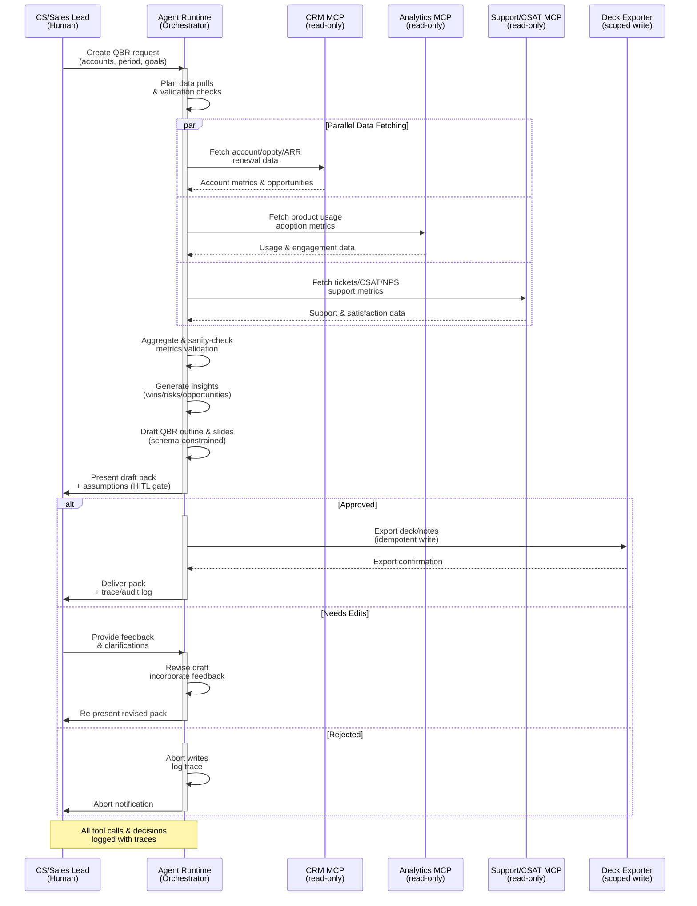

# Product Requirements Document (PRD)
## Sales/CS QBR Pack Builder - AI-Powered Quarterly Business Review Generator

**Document Version:** 1.0  
**Date:** January 2025  
**Owner:** Senior AI Product Manager  
**Status:** Active

---

## Table of Contents

1. [Executive Summary](#executive-summary)
2. [Product Vision & Strategy](#product-vision--strategy)
3. [Product Overview](#product-overview)
4. [Target Users & Personas](#target-users--personas)
5. [Functional Requirements](#functional-requirements)
6. [Non-Functional Requirements](#non-functional-requirements)
7. [Success Metrics & KPIs](#success-metrics--kpis)
8. [Technical Architecture](#technical-architecture)
9. [Workflow Diagram](#workflow-diagram)
10. [Product Roadmap](#product-roadmap)
11. [Risks & Mitigation](#risks--mitigation)
12. [Dependencies & Assumptions](#dependencies--assumptions)

---

## Executive Summary

**Sales/CS QBR Pack Builder** is an enterprise-grade AI-powered system that automatically generates comprehensive Quarterly Business Review (QBR) packs by aggregating data from CRM systems, product analytics, and support platforms. The system uses Large Language Models (LLMs) to synthesize insights, identify wins/risks/opportunities, and create structured presentation decks with human-in-the-loop approval gates.

### Problem Statement

Sales and Customer Success teams face critical challenges in preparing QBR materials:

- **Time-Consuming Data Aggregation**: Manually pulling data from CRM, analytics, and support systems takes hours
- **Inconsistent QBR Formats**: Each QBR is created differently, making it hard to compare across accounts
- **Missed Insights**: Key wins, risks, and opportunities are overlooked in manual analysis
- **Data Silos**: Information scattered across multiple systems requires manual correlation
- **Last-Minute Rush**: QBR preparation often happens at the last minute, reducing quality
- **Limited Scalability**: Can't efficiently prepare QBRs for multiple accounts simultaneously

### Solution Overview

An automated QBR generation system that:

- Aggregates data from CRM (accounts, opportunities, ARR, renewals), product analytics (usage, adoption), and support systems (tickets, CSAT, NPS)
- Uses LLM to synthesize insights and identify wins, risks, and opportunities
- Generates structured QBR outlines and slide decks with schema-constrained outputs
- Provides human-in-the-loop approval gates for review and edits
- Exports presentation-ready decks and supporting documentation
- Maintains audit trails and traceability for all data sources and decisions

### Business Value

- **Efficiency Gains**: Reduce QBR preparation time from 4-6 hours to 15-30 minutes (90% reduction)
- **Consistency**: Standardized QBR format across all accounts for better comparison
- **Insight Quality**: AI-powered analysis surfaces insights that might be missed manually
- **Scalability**: Generate QBRs for multiple accounts simultaneously
- **Data-Driven Decisions**: Comprehensive data aggregation enables better strategic decisions
- **Accountability**: Clear audit trails show data sources and reasoning

---

## Product Vision & Strategy

### Vision Statement

To revolutionize QBR preparation by automatically synthesizing comprehensive account insights from multiple data sources, enabling sales and CS teams to focus on strategic conversations rather than data gathering.

### Strategic Goals

1. **Automation at Scale**: Generate QBR packs for 100% of accounts automatically
2. **Data Integration**: Seamlessly aggregate data from CRM, analytics, and support systems
3. **Insight Generation**: Transform raw data into actionable strategic insights
4. **Quality Assurance**: Human-in-the-loop ensures accuracy and relevance

### Target Market

- **Primary**: Mid-to-large enterprises with dedicated sales/CS teams (50+ accounts)
- **Secondary**: SaaS companies with subscription-based revenue models
- **Tertiary**: Customer success teams managing enterprise accounts

### Competitive Advantages

- **Multi-Source Integration**: Aggregates data from CRM, analytics, and support in one system
- **LLM-Powered Insights**: AI identifies patterns and insights humans might miss
- **Production-Ready**: Complete system with database, API, and dashboard
- **Human-in-the-Loop**: Approval gates ensure quality and accuracy
- **Auditability**: Full traceability of data sources and AI reasoning

---

## Product Overview

### Core Value Proposition

Transform QBR preparation from manual data gathering to automated insight synthesis by providing:

1. **Automated Data Aggregation**: Pull data from CRM, analytics, and support systems automatically
2. **AI-Powered Analysis**: LLM synthesizes insights and identifies wins, risks, and opportunities
3. **Structured Output**: Generate consistent QBR outlines and slide decks
4. **Human Review**: Approval gates ensure accuracy before final delivery
5. **Export Capabilities**: Generate presentation-ready decks and documentation
6. **Historical Analysis**: Track QBR trends and account health over time

### Key Capabilities

#### 1. CRM Data Integration
- **Account Information**: Account details, industry, segment, contract value
- **Opportunity Tracking**: Pipeline, deals, ARR, MRR
- **Renewal Management**: Renewal dates, renewal probability, expansion opportunities
- **Relationship Mapping**: Key stakeholders, decision makers, champions

#### 2. Product Analytics Integration
- **Usage Metrics**: Feature adoption, active users, engagement scores
- **Product Health**: Feature usage trends, product satisfaction
- **Adoption Patterns**: User growth, feature adoption rates
- **Engagement Analysis**: Login frequency, session duration, feature utilization

#### 3. Support & CSAT Integration
- **Support Tickets**: Ticket volume, resolution time, ticket trends
- **Customer Satisfaction**: CSAT scores, NPS, customer feedback
- **Support Health**: Escalation rates, support quality metrics
- **Risk Indicators**: Support trends that indicate account health issues

#### 4. Insight Generation
- **Wins Identification**: Key achievements, milestones, positive trends
- **Risk Detection**: Usage declines, support escalations, contract risks
- **Opportunity Discovery**: Expansion opportunities, upsell potential, feature gaps
- **Trend Analysis**: Historical comparisons, growth patterns, health scores

#### 5. QBR Pack Generation
- **Executive Summary**: High-level account overview and key metrics
- **Account Health Score**: Overall account health assessment
- **Wins & Achievements**: Key wins and positive developments
- **Risks & Challenges**: Identified risks and mitigation strategies
- **Opportunities**: Growth and expansion opportunities
- **Action Items**: Recommended next steps and follow-ups
- **Supporting Data**: Detailed metrics and charts

#### 6. Human-in-the-Loop Review
- **Draft Review**: Present draft QBR pack for review
- **Edit Capabilities**: Allow revisions and clarifications
- **Approval Workflow**: Approve, request changes, or reject
- **Version Control**: Track revisions and changes

---

## Target Users & Personas

### Persona 1: Customer Success Manager

**Name**: Sarah Chen  
**Role**: Customer Success Manager  
**Goals**:
- Prepare comprehensive QBR packs for enterprise accounts
- Identify account health risks early
- Surface expansion opportunities
- Reduce time spent on data gathering

**Pain Points**:
- Manually pulling data from multiple systems takes hours
- Inconsistent QBR formats make comparison difficult
- Missed insights due to manual analysis limitations
- Last-minute QBR preparation reduces quality

**How They Use the Product**:
- **Per Account**: Generate QBR pack, review insights, export deck
- **Quarterly**: Generate QBRs for all assigned accounts
- **Ongoing**: Monitor account health trends and alerts

**Success Criteria**:
- Reduce QBR preparation time by 90%
- Generate consistent, high-quality QBR packs
- Identify risks and opportunities earlier
- Improve account health scores

---

### Persona 2: Sales Director

**Name**: Michael Rodriguez  
**Role**: Sales Director  
**Goals**:
- Review QBR packs for strategic accounts
- Identify cross-sell and upsell opportunities
- Track account health across portfolio
- Make data-driven strategic decisions

**Pain Points**:
- Inconsistent QBR formats make portfolio analysis difficult
- Limited visibility into account health trends
- Manual data correlation is time-consuming
- Missed opportunities due to incomplete data

**How They Use the Product**:
- **Weekly**: Review QBR packs for key accounts
- **Quarterly**: Analyze portfolio-wide QBR trends
- **Ongoing**: Monitor account health dashboards

**Success Criteria**:
- Standardized QBR format across all accounts
- Better visibility into account health
- Faster identification of opportunities
- Improved strategic decision-making

---

### Persona 3: Account Executive

**Name**: Jennifer Park  
**Role**: Account Executive  
**Goals**:
- Prepare QBR presentations for client meetings
- Demonstrate value and ROI to clients
- Identify expansion opportunities
- Maintain strong client relationships

**Pain Points**:
- QBR preparation takes time away from client engagement
- Difficulty correlating data from multiple sources
- Inconsistent presentation quality
- Limited time to prepare for QBR meetings

**How They Use the Product**:
- **Per Client**: Generate QBR pack before client meeting
- **Quarterly**: Prepare QBRs for all assigned accounts
- **As Needed**: Generate ad-hoc account health reports

**Success Criteria**:
- Reduce QBR preparation time significantly
- Generate professional, client-ready presentations
- Better demonstrate value to clients
- More time for client engagement

---

## Functional Requirements

### FR1: QBR Request Management

#### FR1.1: QBR Request Creation
- **Requirement**: System MUST accept QBR generation requests with account and period information
- **Acceptance Criteria**:
  - Accepts QBR request via POST /qbr/generate endpoint
  - Requires account ID, quarter/period, and optional goals/focus areas
  - Returns QBR request ID for tracking
  - Supports batch QBR generation for multiple accounts

#### FR1.2: Request Validation
- **Requirement**: System MUST validate QBR requests before processing
- **Acceptance Criteria**:
  - Validates account ID exists
  - Validates period is valid (past or current quarter)
  - Validates required permissions for account access
  - Returns clear error messages for invalid requests

---

### FR2: Data Aggregation

#### FR2.1: CRM Data Fetching
- **Requirement**: System MUST fetch account data from CRM system (read-only MCP)
- **Acceptance Criteria**:
  - Fetches account information (name, industry, segment, contract value)
  - Retrieves opportunity data (pipeline, deals, ARR, MRR)
  - Gets renewal information (renewal dates, probability, expansion opportunities)
  - Retrieves relationship mapping (stakeholders, decision makers)
  - Handles API failures gracefully with retry logic

#### FR2.2: Analytics Data Fetching
- **Requirement**: System MUST fetch product analytics data (read-only MCP)
- **Acceptance Criteria**:
  - Retrieves usage metrics (feature adoption, active users, engagement)
  - Gets product health data (usage trends, satisfaction scores)
  - Fetches adoption patterns (user growth, feature adoption rates)
  - Retrieves engagement analysis (login frequency, session duration)
  - Handles missing data gracefully

#### FR2.3: Support Data Fetching
- **Requirement**: System MUST fetch support and CSAT data (read-only MCP)
- **Acceptance Criteria**:
  - Retrieves support ticket data (volume, resolution time, trends)
  - Gets customer satisfaction scores (CSAT, NPS, feedback)
  - Fetches support health metrics (escalation rates, quality)
  - Identifies risk indicators (support trends, health issues)
  - Handles data gaps appropriately

#### FR2.4: Data Aggregation & Validation
- **Requirement**: System MUST aggregate and validate data from all sources
- **Acceptance Criteria**:
  - Combines data from CRM, analytics, and support systems
  - Performs sanity checks on metrics (e.g., ARR consistency)
  - Identifies data gaps and anomalies
  - Flags missing or inconsistent data for human review
  - Creates unified data model for analysis

---

### FR3: Insight Generation

#### FR3.1: LLM-Powered Analysis
- **Requirement**: System MUST use LLM to generate insights from aggregated data
- **Acceptance Criteria**:
  - Uses GPT-4o-mini or similar model for analysis
  - Generates wins, risks, and opportunities from data
  - Provides structured JSON output with schema validation
  - Handles various account types and industries
  - Returns confidence scores for insights

#### FR3.2: Wins Identification
- **Requirement**: System MUST identify key wins and achievements
- **Acceptance Criteria**:
  - Identifies positive trends (usage growth, feature adoption)
  - Highlights key milestones and achievements
  - Recognizes successful implementations
  - Prioritizes wins by impact and relevance

#### FR3.3: Risk Detection
- **Requirement**: System MUST detect risks and challenges
- **Acceptance Criteria**:
  - Identifies usage declines and engagement drops
  - Detects support escalation trends
  - Flags contract renewal risks
  - Recognizes account health deterioration
  - Provides risk severity scoring

#### FR3.4: Opportunity Discovery
- **Requirement**: System MUST identify growth and expansion opportunities
- **Acceptance Criteria**:
  - Identifies expansion opportunities (upsell, cross-sell)
  - Recognizes feature gaps and adoption opportunities
  - Highlights underutilized features
  - Suggests strategic growth areas

---

### FR4: QBR Pack Generation

#### FR4.1: Outline Generation
- **Requirement**: System MUST generate QBR outline with structured sections
- **Acceptance Criteria**:
  - Creates executive summary section
  - Generates account health score section
  - Includes wins & achievements section
  - Adds risks & challenges section
  - Includes opportunities section
  - Adds action items section
  - Provides supporting data section

#### FR4.2: Slide Deck Generation
- **Requirement**: System MUST generate presentation-ready slide deck
- **Acceptance Criteria**:
  - Creates slides for each QBR section
  - Includes charts and visualizations for key metrics
  - Uses consistent formatting and branding
  - Generates speaker notes and talking points
  - Exports in standard formats (PPTX, PDF)

#### FR4.3: Schema-Constrained Output
- **Requirement**: System MUST use schema-constrained outputs for all generated content
- **Acceptance Criteria**:
  - All insights follow Pydantic/JSON schemas
  - Schema validation ensures consistency
  - Fail-fast on schema violations
  - Clear error messages for validation failures

---

### FR5: Human-in-the-Loop Review

#### FR5.1: Draft Presentation
- **Requirement**: System MUST present draft QBR pack for human review
- **Acceptance Criteria**:
  - Displays draft QBR pack in review interface
  - Shows all insights and recommendations
  - Highlights data sources and assumptions
  - Provides edit capabilities for all sections
  - Shows confidence scores and reasoning

#### FR5.2: Approval Workflow
- **Requirement**: System MUST support approval workflow with multiple states
- **Acceptance Criteria**:
  - Supports "Approve" state (proceed to export)
  - Supports "Request Changes" state (revise draft)
  - Supports "Reject" state (abort generation)
  - Tracks approval history and revisions
  - Sends notifications on state changes

#### FR5.3: Revision Handling
- **Requirement**: System MUST handle revisions and incorporate feedback
- **Acceptance Criteria**:
  - Accepts feedback and clarifications from reviewers
  - Revises draft based on feedback
  - Maintains version history of revisions
  - Re-presents revised draft for approval

---

### FR6: Export & Delivery

#### FR6.1: Deck Export
- **Requirement**: System MUST export QBR pack in standard formats
- **Acceptance Criteria**:
  - Exports PowerPoint presentation (PPTX)
  - Exports PDF version
  - Exports structured JSON for programmatic access
  - Includes all sections and supporting data
  - Maintains formatting and branding

#### FR6.2: Audit Trail
- **Requirement**: System MUST maintain audit trail for all QBR generations
- **Acceptance Criteria**:
  - Logs all data sources used
  - Tracks all tool calls and LLM interactions
  - Records approval decisions and revisions
  - Stores reasoning artifacts and traces
  - Enables traceability for compliance

---

### FR7: Data Persistence

#### FR7.1: Database Storage
- **Requirement**: System MUST store QBR data in PostgreSQL
- **Acceptance Criteria**:
  - Stores QBR requests and metadata
  - Persists aggregated data from all sources
  - Stores generated insights and recommendations
  - Maintains approval history and revisions
  - Enables historical analysis and trending

#### FR7.2: QBR Retrieval
- **Requirement**: System MUST support retrieving QBR packs
- **Acceptance Criteria**:
  - GET /qbr/{qbr_id} returns QBR pack
  - Returns all sections, insights, and data
  - Supports filtering by account, period, status
  - Enables comparison across QBRs

---

### FR8: API Interface

#### FR8.1: REST API
- **Requirement**: System MUST provide REST API for QBR operations
- **Acceptance Criteria**:
  - POST /qbr/generate for QBR generation
  - GET /qbr/{qbr_id} for retrieval
  - POST /qbr/{qbr_id}/approve for approval
  - POST /qbr/{qbr_id}/revise for revisions
  - GET /health for health checks
  - OpenAPI/Swagger documentation at /docs

---

### FR9: Dashboard & Visualization

#### FR9.1: Streamlit Dashboard
- **Requirement**: System MUST provide Streamlit web interface
- **Acceptance Criteria**:
  - QBR generation interface
  - Draft review and approval interface
  - QBR pack visualization
  - Account health dashboards
  - Historical trend analysis

---

## Non-Functional Requirements

### NFR1: Performance

#### API Response Time
- **QBR Generation**: < 5 minutes for typical QBR (single account, one quarter)
- **Data Aggregation**: < 2 minutes for fetching all data sources
- **QBR Retrieval**: < 1 second for database queries
- **Dashboard Loading**: < 3 seconds for initial load

#### Throughput
- **Concurrent QBR Generation**: Support 10+ concurrent requests
- **Batch Processing**: Process 50+ accounts per hour
- **Data Fetching**: Handle 100+ API calls per minute

#### Scalability
- Database scales to thousands of QBR packs
- Supports high-volume data fetching from multiple sources
- Horizontal scaling via containerization

---

### NFR2: Reliability

#### Availability
- **Target**: 99.5% uptime
- **Health Monitoring**: Health check endpoint for monitoring
- **Database Redundancy**: PostgreSQL replication (future enhancement)

#### Error Handling
- Graceful degradation when external APIs unavailable
- Clear error messages for API failures
- Retry logic for transient errors
- Data validation prevents invalid data storage
- Circuit breakers for external service failures

#### Data Integrity
- Database transactions ensure data consistency
- Foreign key constraints maintain referential integrity
- Indexes optimize query performance
- Idempotent operations prevent duplicates

---

### NFR3: Security

#### API Key Management
- Secure storage via environment variables (.env files)
- API keys never logged or exposed in responses
- Support for multiple API keys (future: key rotation)
- MCP server authentication and authorization

#### Data Privacy
- QBR data stored securely
- Access controls for sensitive account data
- Encrypted database connections (future enhancement)
- GDPR/compliance support through data controls
- PII detection and redaction (future enhancement)

#### Input Validation
- All inputs validated via Pydantic schemas
- SQL injection prevention via parameterized queries
- Rate limiting to prevent abuse (future enhancement)
- RBAC for QBR access control

---

### NFR4: Usability

#### API Documentation
- OpenAPI/Swagger documentation auto-generated
- Comprehensive endpoint documentation with examples
- Clear error response documentation

#### Dashboard UX
- Intuitive Streamlit interface with clear navigation
- Responsive design for different screen sizes
- Loading indicators for long-running operations
- Error messages with actionable guidance

#### Onboarding
- Comprehensive README with quick start guide
- Example QBR data for testing
- Clear setup instructions

---

### NFR5: Maintainability

#### Code Quality
- Type hints throughout codebase
- Docstrings for all public functions and classes
- Modular architecture with clear separation of concerns
- Follow Python PEP 8 style guidelines

#### Testing
- Unit tests for critical functions (analysis, aggregation)
- Integration tests for API endpoints
- Test coverage target: > 70%

#### Documentation
- Inline code comments for complex logic
- Architectural documentation in README
- Database schema documentation

---

### NFR6: Observability

#### Logging
- Structured logging for all API requests
- Log levels configurable (INFO, DEBUG, ERROR)
- Log LLM API calls and responses (sanitized)
- Log database operations and performance
- Log all MCP tool calls and responses

#### Monitoring
- Health check endpoint for monitoring
- Database connection monitoring
- Performance metrics logging (response times, error rates)
- External API health monitoring

#### Debugging
- Detailed error messages with stack traces (development mode)
- Request/response logging for troubleshooting
- Database query logging (optional)
- Trace logging for all agent steps

---

## Success Metrics & KPIs

### Adoption Metrics

1. **Usage Volume**:
   - Number of QBR packs generated per quarter
   - Number of API calls per day
   - Number of active users (CS managers, sales directors)
   - Percentage of accounts with QBR packs generated (target: 100% of key accounts)

2. **Coverage**:
   - Number of QBR packs stored in database
   - Number of accounts covered
   - Historical data retention period

---

### Quality Metrics

1. **Generation Accuracy**:
   - QBR pack completeness: **Target > 95%**
   - Insight accuracy (validated against manual analysis): **Target > 85%**
   - Data aggregation accuracy: **Target > 98%**
   - Schema validation success rate: **Target > 99%**

2. **User Satisfaction**:
   - QBR pack quality score: **Target > 4.0/5.0** user rating
   - Time savings satisfaction: **Target > 4.5/5.0**
   - Insight relevance score: **Target > 4.0/5.0**

---

### Business Impact Metrics

1. **Efficiency Gains**:
   - Time saved per QBR: **Target 90% reduction** (from 4-6 hours to 15-30 minutes)
   - Time to generate QBR pack: **Target < 30 minutes** (including review)
   - QBR pack generation rate: **Target 100%** of requested accounts

2. **Quality Improvements**:
   - Consistency score across QBRs: **Target > 90%**
   - Insight discovery rate (new insights found): **Target > 20%**
   - Risk detection accuracy: **Target > 80%**

3. **Strategic Value**:
   - Expansion opportunities identified: **Target > 15%** increase
   - Risk mitigation actions taken: **Target > 25%** increase
   - Account health score improvements: **Target > 10%** improvement

---

### Technical Metrics

1. **Performance**:
   - API response time p95: **Target < 5 minutes**
   - Data aggregation time p95: **Target < 2 minutes**
   - Database query time p95: **Target < 1 second**
   - API uptime: **Target 99.5%**

2. **Reliability**:
   - Error rate: **Target < 2%**
   - LLM API success rate: **Target > 98%**
   - External API success rate: **Target > 95%**
   - Database uptime: **Target 99.9%**

3. **Code Quality**:
   - Test coverage: **Target > 70%**
   - Code review coverage: 100% of PRs reviewed

---

## Technical Architecture

### High-Level Architecture

```
┌──────────────────┐
│  Streamlit UI    │  (Dashboard/Visualization Layer)
│  dashboard/      │
│  app.py          │
└────────┬─────────┘
         │ HTTP
┌────────▼─────────┐
│   FastAPI API    │  (REST API Layer)
│   api/server.py  │
└────────┬─────────┘
         │
    ┌────┴────┬──────────────┬────────────┐
    │         │              │            │
┌───▼────┐ ┌──▼──────┐  ┌───▼──────┐  ┌─▼────────┐
│ LLM    │ │ QBR     │  │ Database │  │ MCP      │
│Analyzer│ │Analyzer  │  │(Postgres)│  │Servers   │
│        │ │         │  │          │  │          │
└────────┘ └─────────┘  └──────────┘  └──────────┘
```

### Component Architecture

#### 1. API Layer (`api/server.py`)
- FastAPI application with REST endpoints
- Request/response handling and validation
- Database session management
- Health check endpoint
- Approval workflow management

#### 2. Analysis Layer (`models/qbr_analyzer.py`)
- **LLM Integration**: OpenAI GPT-4o-mini for insight generation
- **Structured Extraction**: Generates wins, risks, opportunities with schema validation
- **Data Synthesis**: Combines data from multiple sources
- **Error Handling**: Graceful fallback on LLM failures

#### 3. Data Layer (`db/`)
- **Database Models** (`db.py`): SQLAlchemy ORM models
- **Schema** (`schema.sql`): PostgreSQL schema definition
- **Session Management**: Database connection pooling
- Tables: qbr_requests, qbr_packs, insights, data_sources, approvals

#### 4. MCP Integration (`tools/`)
- **CRM MCP Client**: Fetches account and opportunity data
- **Analytics MCP Client**: Retrieves product usage metrics
- **Support MCP Client**: Gets support tickets and CSAT data
- **Error Handling**: Retry logic and circuit breakers

#### 5. Dashboard (`dashboard/app.py`)
- Streamlit web application
- QBR generation interface
- Draft review and approval interface
- QBR pack visualization
- Account health dashboards

### Technology Stack

#### Core Framework
- **Backend**: FastAPI 0.115.0
- **Web UI**: Streamlit 1.39.0
- **Data Validation**: Pydantic 2.9.2

#### Database
- **Database**: PostgreSQL (via SQLAlchemy 2.0.35)
- **Driver**: psycopg2-binary 2.9.9

#### LLM & AI
- **LLM Provider**: OpenAI (GPT-4o-mini)
- **API Client**: OpenAI Python SDK 1.51.2

#### Data Processing
- **Data Processing**: pandas 2.2.3, numpy 2.1.3
- **ML Utilities**: scikit-learn 1.5.2, scipy 1.13.1

#### Development & Operations
- **Environment**: python-dotenv 1.0.1
- **HTTP Client**: httpx 0.27.2
- **MCP Client**: mcp (future: MCP SDK)

### Data Flow

#### QBR Generation Flow
1. API receives QBR request via POST /qbr/generate
2. System fetches data from CRM, Analytics, and Support (parallel MCP calls)
3. Data aggregation and validation
4. QBR Analyzer processes data using GPT-4o-mini
5. LLM generates insights (wins, risks, opportunities)
6. System creates QBR outline and slide deck structure
7. Draft presented for human review
8. After approval, system exports deck and stores in database
9. API returns QBR pack ID and status

#### Approval Workflow Flow
1. Draft QBR pack presented to reviewer
2. Reviewer can approve, request changes, or reject
3. If changes requested, system incorporates feedback and re-presents
4. If approved, system exports deck and delivers
5. If rejected, system aborts and logs trace

### Integration Patterns

1. **LLM Integration**: OpenAI API with structured JSON output
2. **MCP Integration**: MCP servers for CRM, Analytics, and Support (read-only)
3. **Database Integration**: SQLAlchemy ORM with PostgreSQL
4. **API Design**: RESTful API with OpenAPI documentation
5. **Future**: Direct integrations with Salesforce, Mixpanel, Zendesk, etc.

---

## Workflow Diagram

### Mermaid Swimlane-Style Sequence Diagram



---

## Product Roadmap

### Phase 1: Foundation (Current State)

**Status**: In Progress

- Core functionality implementation
- LLM-powered QBR analysis
- Data aggregation from mock MCP servers
- PostgreSQL database storage
- FastAPI REST API
- Streamlit dashboard
- Basic approval workflow
- Documentation

---

### Phase 2: MCP Integration

**Timeline**: 2 months

#### Real MCP Servers
- [ ] CRM MCP server integration (Salesforce, HubSpot)
- [ ] Analytics MCP server integration (Mixpanel, Amplitude)
- [ ] Support MCP server integration (Zendesk, Intercom)
- [ ] Authentication and authorization for MCP servers
- [ ] Error handling and retry logic

#### Advanced Features
- [ ] Multi-account batch processing
- [ ] Custom QBR templates
- [ ] Branding customization
- [ ] Email delivery of QBR packs

---

### Phase 3: Enhancement

**Timeline**: 3 months

#### Advanced Analytics
- [ ] Historical trend analysis across QBRs
- [ ] Account health scoring algorithms
- [ ] Predictive risk detection
- [ ] Opportunity scoring and prioritization

#### Integration
- [ ] Calendar integration for QBR scheduling
- [ ] Slack/Teams notifications
- [ ] CRM update integration (write-back capabilities)
- [ ] Project management tool integration

---

### Phase 4: Scale

**Timeline**: 3 months

#### Performance & Scalability
- [ ] Database query optimization and indexing
- [ ] Caching layer for frequent queries
- [ ] Horizontal scaling with Kubernetes
- [ ] Connection pooling and optimization

#### API Enhancements
- [ ] Rate limiting and API key management
- [ ] Webhook support for QBR completion
- [ ] GraphQL API option (future consideration)
- [ ] Real-time QBR generation streaming

---

### Phase 5: Intelligence

**Timeline**: 3 months

#### Advanced AI
- [ ] Custom model fine-tuning for domain-specific insights
- [ ] Multi-account pattern detection
- [ ] Cross-account benchmarking
- [ ] Automated QBR scheduling

#### Collaboration Features
- [ ] Multi-user QBR collaboration
- [ ] Comment and annotation system
- [ ] QBR template marketplace
- [ ] Custom insight rules

---

## Risks & Mitigation

### Risk 1: External API Dependencies

**Description**: Dependency on CRM, Analytics, and Support APIs introduces risk of downtime, rate limits, and data inconsistencies.

**Impact**: High - Core functionality depends on external APIs.

**Probability**: High

**Mitigation**:
- Implement robust retry logic and circuit breakers
- Cache data where appropriate
- Provide fallback mechanisms for missing data
- Monitor API health and alert on failures
- Support multiple data source providers

---

### Risk 2: LLM API Availability & Cost

**Description**: Dependency on OpenAI API introduces risk of downtime, rate limits, and cost escalation.

**Impact**: High - Core insight generation depends on LLM.

**Probability**: Medium

**Mitigation**:
- Monitor API usage and costs closely with alerts
- Evaluate alternative LLM providers (Anthropic, open-source models)
- Implement request queuing and retry logic
- Cache analysis results for similar accounts (future)
- Cost optimization through batch processing

---

### Risk 3: Data Quality & Accuracy

**Description**: Inaccurate or incomplete data from external sources may lead to incorrect insights and recommendations.

**Impact**: High - Poor data quality reduces QBR value.

**Probability**: Medium

**Mitigation**:
- Implement data validation and sanity checks
- Flag data gaps and inconsistencies for human review
- Provide confidence scores for insights
- Allow manual data correction
- Regular data quality audits

---

### Risk 4: Human-in-the-Loop Bottleneck

**Description**: Approval workflow may become a bottleneck if reviewers are slow to respond.

**Impact**: Medium - Delays QBR delivery.

**Probability**: Medium

**Mitigation**:
- Set clear SLA expectations for approvals
- Provide notification system for pending approvals
- Support automated approval for low-risk QBRs (future)
- Escalation paths for overdue approvals

---

### Risk 5: Data Privacy & Security

**Description**: QBR packs contain sensitive account and financial data, raising privacy and security concerns.

**Impact**: High - Regulatory compliance and organizational trust at stake.

**Probability**: Medium

**Mitigation**:
- Secure database storage with encryption
- Access controls for sensitive QBR data
- Audit logging for data access
- GDPR/compliance documentation
- Data retention and deletion policies
- PII detection and redaction (future enhancement)

---

### Risk 6: Scalability Limitations

**Description**: Current architecture may not scale to very large organizations with thousands of accounts.

**Impact**: Medium - Limits market adoption for large enterprises.

**Probability**: High

**Mitigation**:
- Design for horizontal scaling from the start
- Database indexing and query optimization
- Caching strategies for frequent queries
- Load testing and performance benchmarking
- Cloud-native deployment options (Kubernetes)

---

## Dependencies & Assumptions

### External Dependencies

#### 1. OpenAI API
- **Required**: Yes (core functionality)
- **Usage**: QBR insight generation
- **Assumptions**:
  - API remains available with reasonable uptime
  - Pricing remains within budget constraints
  - Model quality and capabilities continue to improve
  - Rate limits accommodate expected usage volumes

#### 2. PostgreSQL Database
- **Required**: Yes (for persistent storage)
- **Usage**: QBR data storage
- **Assumptions**:
  - Database hosting available (cloud or on-premise)
  - Database backup and recovery strategies in place
  - Database performance scales with data volume

#### 3. MCP Servers
- **Required**: Yes (for data aggregation)
- **Usage**: CRM, Analytics, and Support data fetching
- **Assumptions**:
  - MCP servers are available and accessible
  - Authentication and authorization mechanisms in place
  - API rate limits accommodate expected usage
  - Data formats are consistent and well-documented

#### 4. Python Ecosystem
- **Required**: Yes
- **Components**: FastAPI, Streamlit, SQLAlchemy, pandas, OpenAI SDK
- **Assumptions**:
  - Library maintenance and compatibility
  - Python 3.8+ support

---

### Internal Dependencies

#### 1. Infrastructure
- **Server Hosting**: Cloud or on-premise infrastructure
- **Container Orchestration**: Docker, Kubernetes (future)
- **CI/CD Pipelines**: For deployment automation
- **Monitoring**: Logging and monitoring infrastructure

#### 2. Data Sources
- **CRM Systems**: Salesforce, HubSpot, or similar
- **Analytics Platforms**: Mixpanel, Amplitude, or similar
- **Support Systems**: Zendesk, Intercom, or similar
- **Assumptions**:
  - APIs are available and documented
  - Data quality is acceptable
  - Access credentials are available

---

### Assumptions

#### 1. User Expertise
- Users have basic technical knowledge to use API or dashboard
- API users understand REST API concepts
- Dashboard users are comfortable with web interfaces
- **Mitigation**: Provide comprehensive documentation and training

#### 2. Data Quality
- External APIs provide reasonably accurate and complete data
- Data formats are consistent across sources
- Account identifiers are consistent across systems
- **Mitigation**: Provide data validation and error handling

#### 3. Business Context
- Organizations have regular QBR processes
- Users see value in automated QBR generation
- Organizations are committed to data-driven account management
- **Mitigation**: Clear value proposition, ROI metrics, user training

#### 4. Adoption
- Organizations are motivated to adopt automated QBR generation
- Change management support is available for user onboarding
- Stakeholders see value in standardized QBR processes
- **Mitigation**: Clear value proposition, integration with existing tools, change management support

#### 5. Regulatory Compliance
- Organizations handle QBR data according to applicable regulations
- Privacy requirements can be met with appropriate safeguards
- Data retention and deletion policies can be implemented
- **Mitigation**: Privacy-by-design approach, compliance documentation, data controls

---

## Appendices

### Appendix A: API Endpoint Reference

See `api/server.py` and visit `/docs` when running the API server for detailed API documentation.

**Key Endpoints**:
- `POST /qbr/generate` - Generate a QBR pack
- `GET /qbr/{qbr_id}` - Get QBR pack
- `POST /qbr/{qbr_id}/approve` - Approve QBR pack
- `POST /qbr/{qbr_id}/revise` - Request revisions
- `GET /health` - Health check

**Request Example**:
```json
{
  "account_id": "acc-001",
  "account_name": "Acme Corp",
  "quarter": "Q1-2025",
  "period_start": "2025-01-01",
  "period_end": "2025-03-31",
  "goals": ["Renewal", "Expansion", "Product Adoption"]
}
```

### Appendix B: Database Schema

See `db/schema.sql` for complete database schema.

**Key Tables**:
- `qbr_requests`: QBR generation requests
- `qbr_packs`: Generated QBR packs
- `insights`: Wins, risks, and opportunities
- `data_sources`: Aggregated data from CRM, Analytics, Support
- `approvals`: Approval history and revisions

### Appendix C: Deployment Guide

See `README.md` for deployment instructions:

**Quick Start**:
1. Install dependencies: `pip install -r requirements.txt`
2. Set OpenAI API key: `export OPENAI_API_KEY=your-key`
3. Initialize database: Run `db/schema.sql` or use `init_db()`
4. Start API: `uvicorn api.server:app --reload --port 8000`
5. Start Dashboard: `streamlit run dashboard/app.py`

### Appendix D: QBR Data Format

QBR request JSON format:
```json
{
  "account_id": "acc-002",
  "account_name": "TechStart Inc",
  "quarter": "Q1-2025",
  "period_start": "2025-01-01",
  "period_end": "2025-03-31",
  "goals": ["Renewal", "Expansion"]
}
```

---

## Document History

| Version | Date | Author | Changes |
|---------|------|--------|---------|
| 1.0 | January 2025 | Senior AI Product Manager | Initial PRD for Sales/CS QBR Pack Builder |

---

**Document Status**: Active  
**Next Review Date**: {date TBD}   
**Approval**: Pending stakeholder review
